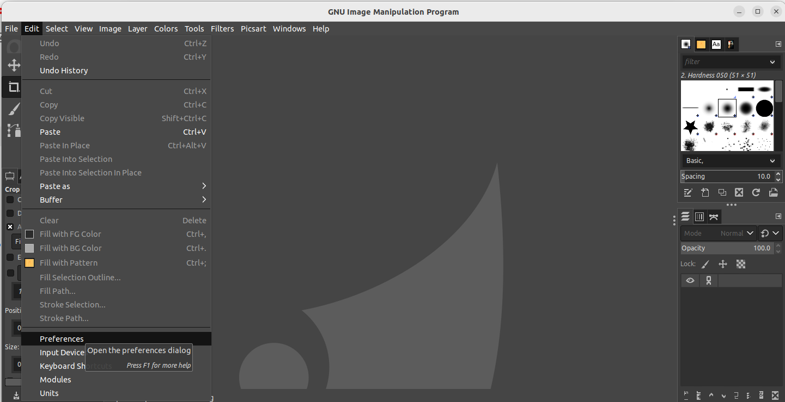
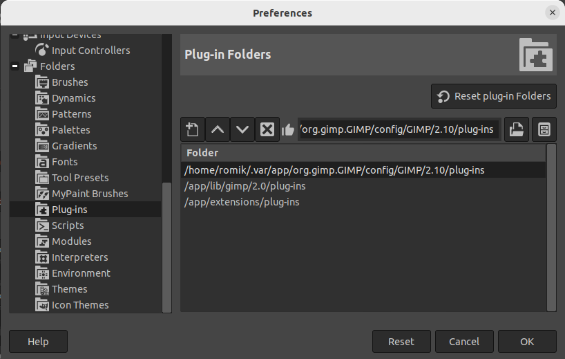
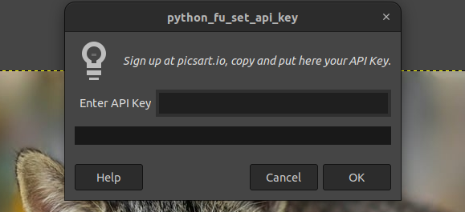

   
# GIMP Plugins: [Picsart APIs for GIMP]

## Description
This project is a GIMP plugin that leverages the Picsart API to provide two key functionalities: Background Removal and Image Upscaling. It allows users to enhance their images directly within GIMP using the powerful tools provided by Picsart.

## Installation
1. **Install GIMP via Flatpak**: Ensure you have Flatpak installed on your system. You can install GIMP using the following command in the terminal:
   ```bash
   flatpak install flathub org.gimp.GIMP
2. **Run GIMP**:
   ```bash
   flatpak run org.gimp.GIMP
Clone this Repository: Clone this repository to your local machine:

git clone https://github.com/PicsArt/picsart-gimp-plugin
Add Files to GIMP: Add all the necessary files from the cloned repository to the GIMP plugins folder.
   
After navigating to Folders -> Plug-ins, choose the first path and add the Python files that you cloned from Git.
   

Using the Plugin:

You must first import the key provided by Picsart using the "Set API Key" option to access the features provided by Picsart.
   
If you do not have an API key, you can create one by using "My Account" or "Support" from the Picsart departments.

Usage:

After successfully registering and importing your key, you can use the Background Remov background and Upscale features provided by the Picsart API.
With your Picsart key, you can send a specified number of requests, and you can check how many requests you have remaining by using the "Get Balance" option.


